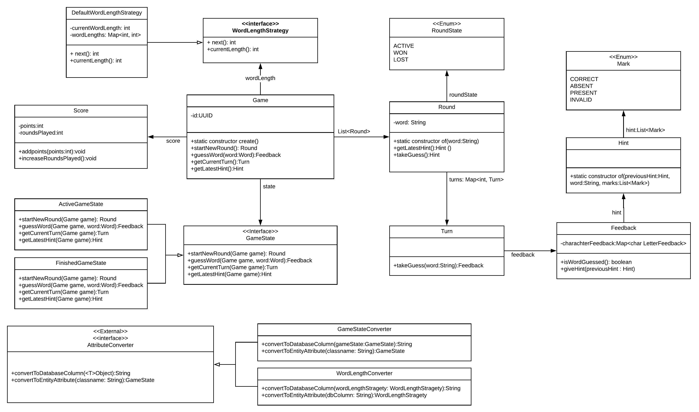

# CISQ1: Lingo Trainer

## Description
Lingo Trainer is an application that helps you get better at lingo. 
It plays just like lingo, but slightly altered to be a single-player variant.   
As the player you have to guess a word starting at a length of 5 letters, then increasing to 6, then 7, then starting back at 5.
The player has a maximum of 5 guesses each round.  
After each guess a hint will return which letters are right, which are wrong and which are incorrect.

## Domain

## Tests
This project is tested with Unit and Integration tests
Dependencies used:
* SonarCloud
* JaCoCo
* PITest (mvnw org.pitest:pitest-maven:mutationCoverage)